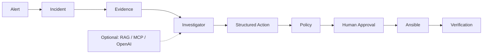
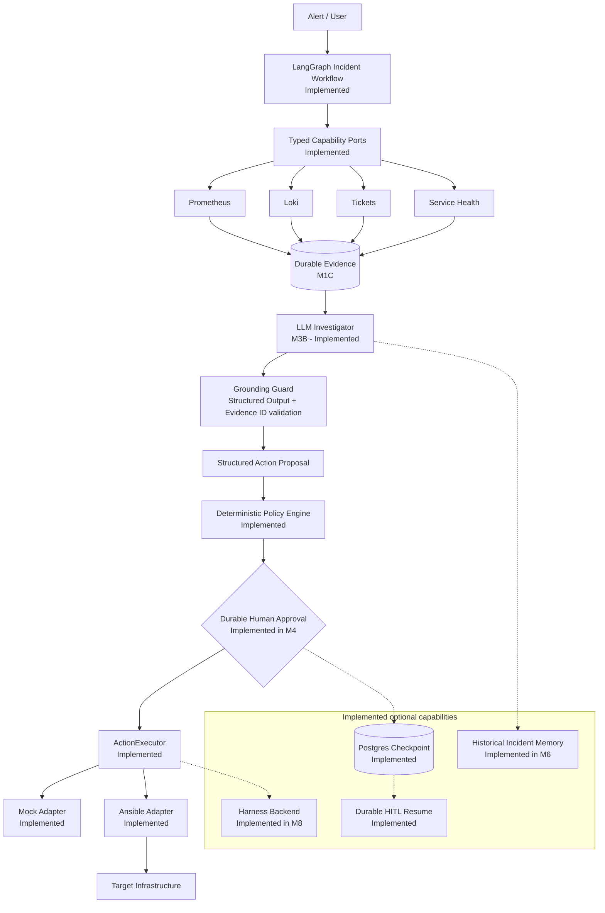

# OpsPilot

[English](README.md) | [简体中文](README.zh-CN.md)

**Evidence-driven, human-controlled incident response.** OpsPilot collects current operational
evidence, produces a grounded diagnosis and structured action, enforces deterministic policy and
durable approval, executes through a fixed Ansible boundary, and verifies recovery.

## Quick Demo

```bash
make demo-local
```

The current milestone (M8) adds a governed multi-backend execution plane. Mock and Ansible remain,
while allowlisted Harness CD pipelines add asynchronous delivery with a transactional outbox,
indeterminate-dispatch recovery, reconciliation, and independent verification. LLM and MCP callers
cannot select a backend or pipeline.

M7 added an MCP `2026-07-28` interoperability plane to the complete
**Observability → Evidence → LLM Investigator → Grounding Guard → Structured Action → Policy →
Durable Human Approval → Ansible → Verification** pipeline against a reproducible local Lab.
The default walkthrough is deterministic and requires no model API key.

**Fault → Evidence → Diagnosis → Human Approval → Ansible → Verified Recovery**

The canonical `service-down` demonstration is synthetic, deterministic, repeatable, and needs no
OpenAI key or external SaaS. It uses real Prometheus, Loki, PostgreSQL checkpointing, Policy/HITL,
fixed Ansible remediation, and health verification. Start with `make demo-doctor`; clean up with
`make demo-down`. See the [10-minute mentor walkthrough](docs/demo/mentor-demo.md).



**Current status:** M1–M8.5 implemented. The canonical local demo remains the stable portfolio entrypoint.
**Next engineering milestone:** M9 GitOps Change Workflow or production-style deployment hardening.

M8.5 adds strict deployment profiles, systemd and fixed-script service control, a read-only doctor,
migration readiness assessment, a safe legacy API/ticket boundary, and a synthetic
Ansible-over-SSH lab. Run `make deployment-preview PROFILE=example-legacy-test`,
`make migration-assess PROFILE=example-legacy-test`, or `make legacy-demo`.

## Demo Profiles

| Capability | Demo Minimal | Demo Full | Production integration |
| --- | --- | --- | --- |
| Prometheus / Loki / Health / Mock Ticket | Included | Included | Configure typed adapters |
| Deterministic investigator | Included | Included | Supported |
| OpenAI investigator | Off | Optional | Operator configuration required |
| Durable HITL / PostgreSQL checkpoint | Included | Included | Auth and deployment configuration required |
| Fixed Ansible remediation | Included | Included | Operator-owned inventory required |
| Historical memory / local Qdrant | Off | Included | Production embedding/vector configuration required |
| MCP capability plane | Off | Included | Auth, trust, and transport configuration required |

The public repository is an independent personal R&D project. The local demo is a disposable Docker
environment, not a claim of production deployment. Real environments require explicit adapters,
credentials, access controls, and operator configuration.

## Why OpsPilot

General-purpose agents can produce plausible commands without operational context or
authorization. OpsPilot separates **assistance from authority**:

- A model may **propose** a typed action, but deterministic policy, target allowlists,
  approval, and an executor boundary decide whether anything can **run**.
- The LLM is a decision assistant, not an authorization authority. Its output is validated,
  grounded, and gated by deterministic controls.
- Every decision path — evidence, diagnosis, proposal, approval, execution, verification — is
  explicit, auditable, and testable.

## Core Principles

- **Evidence Before Action** — investigate before proposing a change.
- **Least Privilege** — expose narrow, typed capabilities, never an arbitrary shell.
- **Human Control** — state-changing actions require explicit approval.
- **Auditable by Design** — decisions, approvals, execution, and verification have durable
  domain boundaries.
- **Deterministic Baseline** — an offline investigator keeps the system reproducible and
  CI-friendly; an LLM is an explicit operator-chosen enhancement, not a hidden dependency.

## Architecture



The Action Safety Core is:

```text
ActionRequest -> ActionPolicyEngine -> approval boundary -> ActionExecutor -> verification
```

No model output is passed to a shell, SSH client, inventory path, or playbook path.

## Current Capabilities

**Implemented:**

- LangGraph incident workflow with explicit, JSON-serializable state (`M2`, `M2.1`)
- Typed, bounded Prometheus / Loki capability adapters plus Ticket / Service Health ports (`M3A`)
- Durable Incident, Evidence, and append-only AuditEvent domain (`M1C`)
- Evidence grounding with validated Evidence IDs and bounded context (`M3B`)
- OpenAI structured investigator behind a provider-neutral port (`M3B`)
- Deterministic offline investigator baseline (no API key required)
- Deterministic policy engine with target allowlists and fail-closed rules
- Mock and fixed-mapping Ansible executors behind a dependency-injected port (`M1A`/`M1B`)
- Governed Mock, Ansible, and allowlisted Harness execution profiles with reconciliation (`M8`)
- Audit / evaluation foundation: evaluation fixtures, safety cases, secret scan in CI

**Planned (not yet implemented):**

- GitOps governed change workflow (`M9`)
- Advanced evaluation and agent observability (`M10`/`M11`)

## Safety Model

The LLM is a decision assistant, not an authorization authority. Read-only actions can be
allowed automatically. Service restarts are medium risk and remain blocked until approval.
Unknown actions, unknown targets, malformed parameters, and extra fields fail closed.

### Safety Highlights

- **No arbitrary shell** — only enumerated structured actions with strict schemas.
- **No arbitrary PromQL / LogQL** — query templates are application-owned.
- **Evidence IDs validated** — the model can only reference Evidence that exists in the current
  Incident; it cannot invent IDs.
- **Prompt-injected logs/tickets treated as untrusted data** — evidence is serialized as data,
  and enforceable guards (schema, grounding, policy) follow generation.
- **LLM cannot authorize execution** — policy and approval are deterministic.
- **Mutating actions require approval** — medium-risk actions stop at `WAITING_APPROVAL`.
- **Executor selected by operator configuration** — workflow code never selects a backend and
  fails closed if the dependency is absent.
- **No hidden chain-of-thought persistence** — only auditable conclusions are stored.
- **Secret-safe audit metadata** — no credentials, raw prompts, or raw evidence bodies in audit.

See [Safety Model](docs/safety-model.md).

## Demo

Run a complete deterministic walkthrough without an API key, database, Prometheus, Loki, ticket
system, or network access:

```bash
uv sync --project backend --extra dev --locked
make demo
```

The input is `service unavailable`, with `SERVICE_UP = 0`, an error log, unavailable health, and
a related ticket. The terminal result is:

```text
Incident Created
Evidence Collected
  - Metric [ev-service-up] SERVICE_UP = 0
  - Log [ev-error-log] ERROR worker stopped accepting requests
  - Health [ev-health] Health check is unavailable
  - Ticket [ev-ticket] Related ticket reports a failed service start
Investigation Result
Diagnosis
  root_cause=checkout-api is stopped after a failed service start
  evidence_references=ev-service-up, ev-error-log, ev-health, ev-ticket
Action Proposal
  action=restart_service
Risk Assessment
  risk=MEDIUM
WAITING_APPROVAL
```

The checked-in synthetic [incident scenarios](demo/README.md) validate grounded evidence
references and pass the typed proposal through the real deterministic policy engine. The runner
never invokes an executor and stops at `WAITING_APPROVAL`; durable approval and resume belong to
**M4**. See the [recording guide](docs/demo.md) for terminal and architecture walkthroughs.

## Project Tour

Read [Architecture](docs/architecture.md) → [Safety Model](docs/safety-model.md) →
[Incident Workflow](docs/design/langgraph-incident-workflow.md) →
[Observability Capabilities](docs/design/observability-capabilities.md) →
[LLM Investigator](docs/design/llm-investigator.md) → [Roadmap](docs/roadmap.md).

The [documentation index](docs/README.md), [ADR index](docs/adr/README.md), and
[interview preparation index](docs/interview/README.md) provide deeper navigation.

## Quick Start

Two modes are supported; **offline mode needs no paid API key**.

### Offline / deterministic mode (default)

Prerequisites: Python 3.13, [uv](https://docs.astral.sh/uv/), and Node.js 22+.

```bash
uv sync --project backend --extra dev
uv run --project backend pytest backend/tests

cd frontend
npm ci
npm test
npm run dev
```

The default `LLM_MODE=deterministic` (see `.env.example`) runs the fully offline baseline:
no `OPENAI_API_KEY` is required, no network call is made, and CI stays deterministic.

### LLM mode (optional)

Set these in `.env` (never commit `.env`):

```bash
LLM_MODE=llm
LLM_PROVIDER=openai
LLM_MODEL=<model name, e.g. gpt-5-mini>
LLM_API_KEY=<your key>
```

LLM mode requires a valid `OPENAI_API_KEY` and an operator-approved model configuration.
Provider failures are explicit and auditable — there is no silent fallback to the
deterministic baseline.

Copy `.env.example` to `.env` and replace every placeholder before starting the API.

## Current Status

| Area | Status |
| --- | --- |
| M1A Action Safety Core | **Implemented** |
| M1B Portable Execution Boundary | **Implemented** |
| M1C Incident Domain + Audit | **Implemented** |
| M2 LangGraph Incident Workflow | **Implemented** |
| M2.1 Workflow Runtime Hardening | **Implemented** |
| M3A Observability Capabilities | **Implemented** |
| M3B Evidence-Grounded LLM Investigator | **Implemented** |
| M3.5 Portfolio & Demo Readiness | **Implemented** |
| M4 Durable HITL + Postgres Checkpoint | **Implemented** |
| M5 Reproducible Incident Lab | **Implemented** |
| M6 Historical Incident Memory / Hybrid RAG | **Implemented** |
| M7 MCP Capability Boundary | **Implemented** |
| M8 Multi-backend Governed Execution | **Implemented** |
| M8.5 Deployment Compatibility & Legacy Migration Bridge | **Implemented** |

The worker builds one operator-configured `ActionService` per iteration from the selected Mock or
Ansible backend and the enabled Target allowlist. It injects that same policy/executor boundary
into both ordinary Operations and LangGraph workflows; workflow code never selects a backend and
fails closed if the dependency is absent.

LangGraph uses stable `thread_id = workflow_id` identifiers. Development tests may use an in-memory
saver; the demo uses PostgreSQL checkpoint persistence and identity-bound approval/resume.

The legacy SSH and service-script runtime was removed in M1B. Ansible may use SSH internally
according to operator-owned inventory, but that is not part of the Agent/API contract.

## Roadmap

| Milestone | Status |
| --- | --- |
| M1A – M8.5 | **Implemented** (see Current Status) |
| Local Demo Closeout | **Implemented** |
| M8 Harness Multi-backend Execution | **Implemented** |
| M8.5 Deployment Compatibility | **Implemented** |
| M9 GitOps | **Next** |
| M10 Risk Reviewer / Evaluation | Future |
| M11 Agent Observability | Future |

### Portfolio Entry Point

The canonical local demonstration remains the stable public portfolio entry point. M8 governed
multi-backend execution and the M8.5 synthetic legacy-environment migration bridge are implemented.

## Why this project is different

- **Not a chatbot wrapper** — the LLM performs one narrow, structured transformation: bounded
  Evidence → validated investigation result.
- **Evidence-driven** — the model can only reference real, deduplicated Incident Evidence IDs.
- **Explicit LangGraph workflow** — investigation is a testable state machine, not an open-ended
  prompt loop.
- **Deterministic authorization boundary** — policy, allowlists, and approval are code, not
  model output.
- **Infrastructure-safe execution** — typed adapters with fixed mappings; no shell, no raw
  query language, no caller-controlled paths.
- **Evaluation and auditability** — deterministic evaluation fixtures, safety cases, and an
  append-only audit trail are first-class.

## Documentation

- [Documentation index](docs/README.md) — English
- [文档索引](docs/zh-CN/README.md) — 简体中文
- [Architecture](docs/architecture.md)
- [Safety Model](docs/safety-model.md)
- [Roadmap](docs/roadmap.md)
- [Development guide](docs/development.md)
- [Testing strategy](docs/testing.md)
- [Design docs](docs/design/)
- [Architecture decisions (ADR)](docs/adr/)
- [Interview notes](docs/interview/)
- [Learning map](docs/learning-map.md)
- [Translation policy](docs/translation-policy.md)
- [Security policy](SECURITY.md)
- [Contributing](CONTRIBUTING.md)

License: see the repository `LICENSE` file supplied by the project owner.
