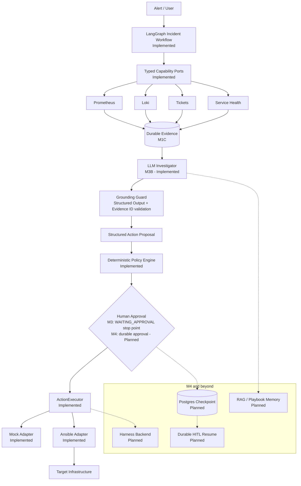

# OpsPilot

[English](README.md) | [简体中文](README.zh-CN.md)

**Agentic Incident Response Platform**

OpsPilot is an open-source project for evidence-driven, human-controlled incident response.
It is built to help SRE and incident responders collect evidence, form explicit hypotheses,
propose structured actions, and execute approved changes through constrained infrastructure
adapters — never through an arbitrary shell.

The current milestone (M3B) is a stable portfolio point: the project demonstrates a complete
**Observability → Evidence → LLM Investigator → Grounding Guard → Structured Action → Policy →
Human Approval → Executor** pipeline, and deliberately **stops before mutating actions are
executed without durable approval**. Durable approval/resume is the next milestone (M4).

## Why OpsPilot

General-purpose agents can produce plausible commands without operational context or
authorization. OpsPilot separates **assistance from authority**:

- A model may **propose** a typed action, but deterministic policy, target allowlists,
  approval, and an executor boundary decide whether anything can **run**.
- The LLM is a decision assistant, not an authorization authority. Its output is validated,
  grounded, and gated by deterministic controls.
- Every decision path — evidence, diagnosis, proposal, approval, execution, verification — is
  explicit, auditable, and testable.

## Core Principles

- **Evidence Before Action** — investigate before proposing a change.
- **Least Privilege** — expose narrow, typed capabilities, never an arbitrary shell.
- **Human Control** — state-changing actions require explicit approval.
- **Auditable by Design** — decisions, approvals, execution, and verification have durable
  domain boundaries.
- **Deterministic Baseline** — an offline investigator keeps the system reproducible and
  CI-friendly; an LLM is an explicit operator-chosen enhancement, not a hidden dependency.

## Architecture



The Action Safety Core is:

```text
ActionRequest -> ActionPolicyEngine -> approval boundary -> ActionExecutor -> verification
```

No model output is passed to a shell, SSH client, inventory path, or playbook path.

## Current Capabilities

**Implemented:**

- LangGraph incident workflow with explicit, JSON-serializable state (`M2`, `M2.1`)
- Typed, bounded Prometheus / Loki capability adapters plus Ticket / Service Health ports (`M3A`)
- Durable Incident, Evidence, and append-only AuditEvent domain (`M1C`)
- Evidence grounding with validated Evidence IDs and bounded context (`M3B`)
- OpenAI structured investigator behind a provider-neutral port (`M3B`)
- Deterministic offline investigator baseline (no API key required)
- Deterministic policy engine with target allowlists and fail-closed rules
- Mock and fixed-mapping Ansible executors behind a dependency-injected port (`M1A`/`M1B`)
- Audit / evaluation foundation: evaluation fixtures, safety cases, secret scan in CI

**Planned (not yet implemented):**

- Durable HITL with Postgres checkpoint and resume (`M4`)
- Incident Lab (`M5`)
- RAG / playbook memory (`M6`)
- MCP capability boundary (`M7`)
- Harness multi-backend execution (`M8`)
- GitOps governed change workflow (`M9`)
- Advanced evaluation and agent observability (`M10`/`M11`)

## Safety Model

The LLM is a decision assistant, not an authorization authority. Read-only actions can be
allowed automatically. Service restarts are medium risk and remain blocked until approval.
Unknown actions, unknown targets, malformed parameters, and extra fields fail closed.

### Safety Highlights

- **No arbitrary shell** — only enumerated structured actions with strict schemas.
- **No arbitrary PromQL / LogQL** — query templates are application-owned.
- **Evidence IDs validated** — the model can only reference Evidence that exists in the current
  Incident; it cannot invent IDs.
- **Prompt-injected logs/tickets treated as untrusted data** — evidence is serialized as data,
  and enforceable guards (schema, grounding, policy) follow generation.
- **LLM cannot authorize execution** — policy and approval are deterministic.
- **Mutating actions require approval** — medium-risk actions stop at `WAITING_APPROVAL`.
- **Executor selected by operator configuration** — workflow code never selects a backend and
  fails closed if the dependency is absent.
- **No hidden chain-of-thought persistence** — only auditable conclusions are stored.
- **Secret-safe audit metadata** — no credentials, raw prompts, or raw evidence bodies in audit.

See [Safety Model](docs/safety-model.md).

## Example Incident Flow

A single deterministic demo path shows the whole pipeline:

```text
SERVICE_UP = 0
+ error logs
+ related ticket
+ health unavailable
        ↓
Evidence collection            (M3A: bounded, typed, provenance-preserving)
        ↓
LLM grounded diagnosis         (M3B: strict schema + Evidence ID validation)
        ↓
restart_service proposal
        ↓
MEDIUM risk                    (deterministic policy)
        ↓
WAITING_APPROVAL               ← M3 stops here for mutating actions
```

> **Current M3 behavior:** the workflow stops at `WAITING_APPROVAL` before any mutating action is
> executed. Durable approval and resume are implemented in **M4** — not in this milestone.
> Read-only actions (for example status checks) may proceed automatically.

## Quick Start

Two modes are supported; **offline mode needs no paid API key**.

### Offline / deterministic mode (default)

Prerequisites: Python 3.13, [uv](https://docs.astral.sh/uv/), and Node.js 22+.

```bash
uv sync --project backend --extra dev
uv run --project backend pytest backend/tests

cd frontend
npm ci
npm test
npm run dev
```

The default `LLM_MODE=deterministic` (see `.env.example`) runs the fully offline baseline:
no `OPENAI_API_KEY` is required, no network call is made, and CI stays deterministic.

### LLM mode (optional)

Set these in `.env` (never commit `.env`):

```bash
LLM_MODE=llm
LLM_PROVIDER=openai
LLM_MODEL=<model name, e.g. gpt-5-mini>
LLM_API_KEY=<your key>
```

LLM mode requires a valid `OPENAI_API_KEY` and an operator-approved model configuration.
Provider failures are explicit and auditable — there is no silent fallback to the
deterministic baseline.

Copy `.env.example` to `.env` and replace every placeholder before starting the API.

## Current Status

| Area | Status |
| --- | --- |
| M1A Action Safety Core | **Implemented** |
| M1B Portable Execution Boundary | **Implemented** |
| M1C Incident Domain + Audit | **Implemented** |
| M2 LangGraph Incident Workflow | **Implemented** |
| M2.1 Workflow Runtime Hardening | **Implemented** |
| M3A Observability Capabilities | **Implemented** |
| M3B Evidence-Grounded LLM Investigator | **Implemented** |
| M4 Durable HITL + Postgres Checkpoint | **Planned — next milestone** |

The worker builds one operator-configured `ActionService` per iteration from the selected Mock or
Ansible backend and the enabled Target allowlist. It injects that same policy/executor boundary
into both ordinary Operations and LangGraph workflows; workflow code never selects a backend and
fails closed if the dependency is absent.

M2 injects LangGraph's own `BaseCheckpointSaver` port and uses `InMemorySaver` for development and
tests. Stable LangGraph threads use `thread_id = workflow_id`, but process restarts lose memory
checkpoints. Production-grade Postgres checkpoint persistence and authenticated approval/resume
belong to M4.

The legacy SSH and service-script runtime was removed in M1B. Ansible may use SSH internally
according to operator-owned inventory, but that is not part of the Agent/API contract.

## Roadmap

| Milestone | Status |
| --- | --- |
| M1A – M3B | **Done** (see Current Status) |
| **M4 Durable HITL + Postgres Checkpoint** | **Next** |
| M5 Incident Lab | Future |
| M6 Playbook Memory / RAG | Future |
| M7 MCP | Future |
| M8 Harness Multi-backend Execution | Future |
| M9 GitOps | Future |
| M10 Risk Reviewer / Evaluation | Future |
| M11 Agent Observability | Future |

### Current Pause Point

**M3B represents the current stable portfolio milestone.** The project intentionally pauses new
core features here: the evidence-grounded investigation pipeline is complete, documented, and
tested, and the boundary before mutating execution is explicit. The next engineering milestone is
**M4 — Durable HITL + Postgres Checkpoint**.

## Why this project is different

- **Not a chatbot wrapper** — the LLM performs one narrow, structured transformation: bounded
  Evidence → validated investigation result.
- **Evidence-driven** — the model can only reference real, deduplicated Incident Evidence IDs.
- **Explicit LangGraph workflow** — investigation is a testable state machine, not an open-ended
  prompt loop.
- **Deterministic authorization boundary** — policy, allowlists, and approval are code, not
  model output.
- **Infrastructure-safe execution** — typed adapters with fixed mappings; no shell, no raw
  query language, no caller-controlled paths.
- **Evaluation and auditability** — deterministic evaluation fixtures, safety cases, and an
  append-only audit trail are first-class.

## Documentation

- [Documentation index](docs/README.md) — English
- [文档索引](docs/zh-CN/README.md) — 简体中文
- [Architecture](docs/architecture.md)
- [Safety Model](docs/safety-model.md)
- [Roadmap](docs/roadmap.md)
- [Development guide](docs/development.md)
- [Testing strategy](docs/testing.md)
- [Design docs](docs/design/)
- [Architecture decisions (ADR)](docs/adr/)
- [Interview notes](docs/interview/)
- [Learning map](docs/learning-map.md)
- [Translation policy](docs/translation-policy.md)
- [Security policy](SECURITY.md)
- [Contributing](CONTRIBUTING.md)

License: see the repository `LICENSE` file supplied by the project owner.
