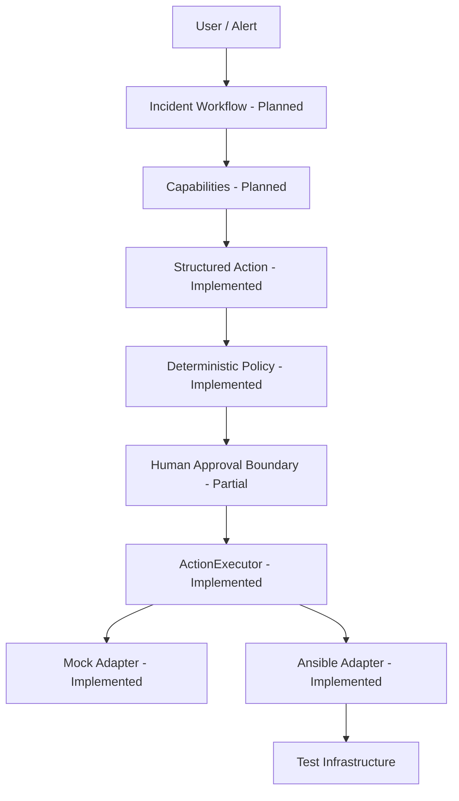

# OpsPilot

**Agentic Incident Response Platform**

OpsPilot is an open-source project for evidence-driven, human-controlled incident response.
It is being built to help SRE and incident responders collect evidence, form explicit
hypotheses, propose structured actions, and execute approved changes through constrained
infrastructure adapters.

## Problem

General-purpose agents can produce plausible commands without possessing operational context
or authorization. OpsPilot separates assistance from authority: a model may propose a typed
action, but deterministic policy, target allowlists, approval, and an executor boundary decide
whether anything can run.

## Design Principles

- **Evidence Before Action** — investigate before proposing a change.
- **Least Privilege** — expose narrow capabilities, never an arbitrary shell.
- **Human Control** — state-changing actions require explicit approval.
- **Auditable by Design** — decisions, approvals, execution, and verification have durable
  domain boundaries.

## Architecture



The Action Safety Core uses:

```text
ActionRequest -> ActionPolicyEngine -> approval boundary -> ActionExecutor -> verification
```

No model output is passed to a shell, SSH client, inventory path, or playbook path.

## Safety Model

The LLM is a decision assistant, not an authorization authority. Read-only actions can be
allowed automatically. Service restarts are medium risk and remain blocked until approval.
Unknown actions, unknown targets, malformed parameters, and extra fields fail closed.

See [Safety Model](docs/safety-model.md).

## Current Status

- **Implemented:** strict structured actions, deterministic risk policy, dependency-injected
  executor port, Mock adapter, fixed-mapping Ansible adapter, backend/frontend regression base.
- **Partial:** legacy operation approval and audit components retained for migration.
- **Planned:** LangGraph, LLM integration, metrics, logs, tickets, MCP, RAG, and incident lab.

Legacy SSH and `services.sh` integration code is deprecated and isolated from the new domain.
Its removal is Milestone 1B.

## Quick Start

Prerequisites: Python 3.13, [uv](https://docs.astral.sh/uv/), and Node.js 22+.

```bash
uv sync --project backend --extra dev
uv run --project backend pytest backend/tests

cd frontend
npm ci
npm test
npm run dev
```

Copy `.env.example` to `.env` and replace every placeholder before starting the API. Never
commit `.env`.

## Development and Testing

- [Development guide](docs/development.md)
- [Testing strategy](docs/testing.md)
- [Architecture](docs/architecture.md)
- [Roadmap](docs/roadmap.md)
- [Contributing](CONTRIBUTING.md)

## Documentation

- [Learning map](docs/learning-map.md)
- [Interview notes](docs/interview/)
- [Architecture decisions](docs/adr/)
- [Security policy](SECURITY.md)

License: see the repository `LICENSE` file supplied by the project owner.
