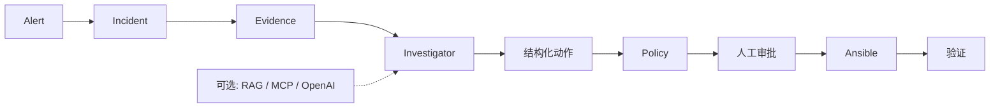
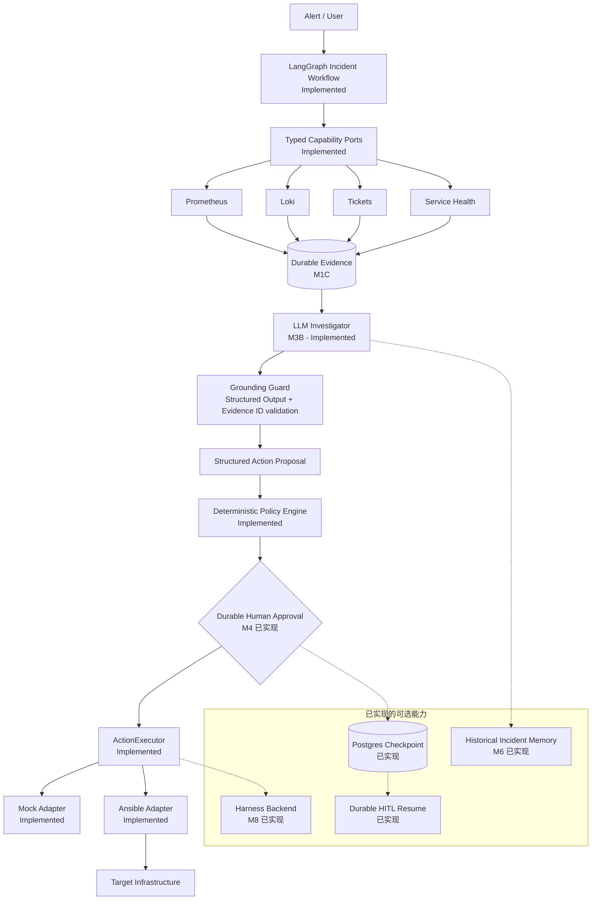

# OpsPilot

[English](README.md) | [简体中文](README.zh-CN.md)

**证据驱动、人工控制的事故响应。** OpsPilot 收集当前事故证据，生成有证据约束的诊断与
结构化动作，通过确定性策略、持久化人工审批、固定 Ansible 边界和独立验证完成恢复。

## 快速演示

```bash
make demo-local
```

当前里程碑（M8）增加 governed multi-backend execution plane。Mock、Ansible 继续保留，并通过
allowlisted Harness CD pipeline 支持异步执行、transactional outbox、UNKNOWN 副作用恢复、
reconciliation 与独立 verification。LLM 和 MCP 都不能选择 backend 或 pipeline。

M7 在完整流水线上增加 MCP `2026-07-28` capability interoperability plane：
**可观测性 → 证据 → LLM 调查器 → 证据约束（Evidence Grounding）→ 结构化动作 → 策略 →
持久化人工审批 → Ansible → 验证**。默认演示使用确定性调查器，不需要模型 API Key。

**故障 → 证据 → 诊断 → 人工审批 → Ansible → 恢复验证**

默认 `service-down` 演示使用合成环境和确定性调查器，不需要 OpenAI Key 或外部 SaaS。
运行前可用 `make demo-doctor` 检查环境，完成后用 `make demo-down` 清理。详见
[10 分钟 Mentor 演示脚本](docs/demo/mentor-demo.md)。



**当前状态：** M1–M8.5 已实现。标准本地演示仍是稳定的 Portfolio 入口。
**下一工程里程碑：** M9 GitOps Change Workflow 或 Production-style Deployment Hardening。

M8.5 增加严格部署 Profile、systemd / 固定脚本服务控制、只读 doctor、迁移就绪度评估、
安全的遗留 API / Ticket 边界，以及 synthetic Ansible-over-SSH Lab。

## 演示 Profile

| 能力 | Demo Minimal | Demo Full | 生产集成 |
| --- | --- | --- | --- |
| Prometheus / Loki / Health / Mock Ticket | 包含 | 包含 | 配置类型化适配器 |
| 确定性调查器 | 包含 | 包含 | 支持 |
| OpenAI 调查器 | 关闭 | 可选 | 需要运维配置 |
| 持久 HITL / PostgreSQL checkpoint | 包含 | 包含 | 需要认证与部署配置 |
| 固定 Ansible 修复 | 包含 | 包含 | 需要运维自有 inventory |
| 历史 Memory / 本地 Qdrant | 关闭 | 包含 | 需要生产检索配置 |
| MCP capability plane | 关闭 | 包含 | 需要 auth / trust / transport 配置 |

本公开仓库是独立个人 R&D 项目。本地演示是可丢弃的 Docker 合成环境，不代表已在公司
生产环境部署。真实环境需要显式适配器、凭据、访问控制与运维配置。

## 为什么需要 OpsPilot

通用智能体会生成看似合理、但缺乏运维上下文与授权的命令。OpsPilot 把「辅助」与「授权」
彻底分离：

- 模型可以**提议**一个类型化动作，但能否真正**执行**由确定性策略、目标白名单、审批与
  执行器边界决定。
- LLM 是决策助手，不是授权主体。它的输出要经过校验、证据约束和确定性控制的门禁。
- 证据、诊断、提议、审批、执行、验证——每一步都是显式、可审计、可测试的。

## 核心原则

- **证据先于动作（Evidence Before Action）** —— 先调查，再提议变更。
- **最小权限（Least Privilege）** —— 只暴露狭窄的类型化能力，绝不暴露任意 shell。
- **人工控制（Human Control）** —— 改变状态的动作用于必须显式审批。
- **默认可审计（Auditable by Design）** —— 决策、审批、执行、验证都有持久的领域边界。
- **确定性基线（Deterministic Baseline）** —— 离线调查器让系统可复现、对 CI 友好；
  LLM 是运维人员显式选择的增强，不是隐藏依赖。

## 架构



动作安全核心（Action Safety Core）为：

```text
ActionRequest -> ActionPolicyEngine -> approval boundary -> ActionExecutor -> verification
```

任何模型输出都不会被传给 shell、SSH 客户端、inventory 路径或 playbook 路径。

## 当前能力

**已实现（Implemented）：**

- LangGraph 事故工作流，显式、可 JSON 序列化的状态（`M2`、`M2.1`）
- 类型化、有边界的 Prometheus / Loki 能力适配器，以及 Ticket / Service Health 端口（`M3A`）
- 持久化 Incident、Evidence 与 append-only AuditEvent 领域模型（`M1C`）
- 证据约束（Evidence Grounding）：校验 Evidence ID、限制上下文（`M3B`）
- Provider 无关端口背后的 OpenAI 结构化调查器（`M3B`）
- 确定性离线调查基线（无需 API key）
- 确定性策略引擎：目标白名单与 fail-closed 规则
- 依赖注入端口背后的 Mock 与固定映射 Ansible 执行器（`M1A`/`M1B`）
- 受治理的 Mock、Ansible 和 allowlisted Harness 执行 Profile 及 reconciliation（`M8`）
- 审计 / 评估基础：评估夹具、安全用例、CI 中的 secret 扫描

## MCP Capability Plane

M7 使用官方 Python SDK，以 MCP `2026-07-28` 通过 stdio 和无状态 Streamable HTTP 暴露固定
allowlist 的 typed observability 与 historical-memory 工具。MCP annotations 只是提示；Policy、
Evidence ownership、durable HITL 和固定 Executor 仍是唯一安全边界。唯一写操作工具只创建
remediation proposal 并返回 approval reference，不能直接执行。运行 `make mcp-demo` 验证互操作。

**计划中（Planned，尚未实现）：**

- GitOps 受治理变更工作流（`M9`）
- 高级评估与智能体可观测性（`M10`/`M11`）

## 安全模型

LLM 是决策助手，不是授权主体。只读动作可以自动放行；服务重启属于中风险，在获得审批前
保持阻塞。未知动作、未知目标、畸形参数与多余字段一律 fail closed。

### 安全要点（Safety Highlights）

- **无任意 shell** —— 只有带严格 schema 的枚举型结构化动作。
- **无任意 PromQL / LogQL** —— 查询模板由应用拥有。
- **Evidence ID 经过校验** —— 模型只能引用当前 Incident 中真实存在的证据，无法虚构 ID。
- **被提示注入的日志/工单视为不可信数据** —— 证据按数据序列化，生成之后还有 schema、
  证据约束、策略等可强制执行的防线。
- **LLM 不能授权执行** —— 策略与审批都是确定性的。
- **变更类动作必须审批** —— 中风险动作停在 `WAITING_APPROVAL`。
- **执行器由运维配置选择** —— 工作流代码从不选择后端，依赖缺失时 fail closed。
- **不持久化隐藏的思维链（Chain-of-Thought）** —— 只保留可审计的结论。
- **审计元数据不泄漏密钥** —— 审计中不含凭据、原始 prompt 或原始证据正文。

参见 [安全模型](docs/zh-CN/safety-model.md)。

## Demo

无需 API Key、数据库、Prometheus、Loki、工单系统或网络即可运行完整的确定性演示：

```bash
uv sync --project backend --extra dev --locked
make demo
```

输入为 `service unavailable`，证据包含 `SERVICE_UP = 0`、ERROR 日志、不可用的健康检查和
关联工单。输出给出带 Evidence ID 引用的根因、`restart_service` 提议、`MEDIUM` 风险，并在
`WAITING_APPROVAL` 停止。演示不会调用执行器；持久化审批与恢复属于 **M4**。

参见[演示场景](demo/README.md)和[录制指南](docs/demo.md)。

## Project Tour

推荐阅读顺序：[架构](docs/zh-CN/architecture.md) → [安全模型](docs/zh-CN/safety-model.md) →
[Incident 工作流](docs/zh-CN/design/langgraph-incident-workflow.md) →
[可观测性能力](docs/zh-CN/design/observability-capabilities.md) →
[LLM 调查器](docs/zh-CN/design/llm-investigator.md) → [路线图](docs/zh-CN/roadmap.md)。

## 快速开始

支持两种模式；**离线模式不需要付费 API**。

### 离线 / 确定性模式（默认）

前置条件：Python 3.13、[uv](https://docs.astral.sh/uv/)、Node.js 22+。

```bash
uv sync --project backend --extra dev
uv run --project backend pytest backend/tests

cd frontend
npm ci
npm test
npm run dev
```

默认 `LLM_MODE=deterministic`（见 `.env.example`）即完全离线基线：不需要
`OPENAI_API_KEY`，不发任何网络请求，CI 保持确定性。

### LLM 模式（可选）

在 `.env` 中配置（不要把 `.env` 提交到仓库）：

```bash
LLM_MODE=llm
LLM_PROVIDER=openai
LLM_MODEL=<模型名，例如 gpt-5-mini>
LLM_API_KEY=<你的 key>
```

LLM 模式需要有效的 `OPENAI_API_KEY` 与经运维确认的模型配置。Provider 失败是显式、可审计
的——不会悄悄回退到确定性基线。

把 `.env.example` 复制为 `.env`，并在启动 API 前替换所有占位符。

## 当前状态

| 里程碑 | 状态 |
| --- | --- |
| M1A Action Safety Core | **已实现** |
| M1B Portable Execution Boundary | **已实现** |
| M1C Incident Domain + Audit | **已实现** |
| M2 LangGraph Incident Workflow | **已实现** |
| M2.1 Workflow Runtime Hardening | **已实现** |
| M3A Observability Capabilities | **已实现** |
| M3B Evidence-Grounded LLM Investigator | **已实现** |
| M3.5 Portfolio & Demo Readiness | **已实现** |
| M4 Durable HITL + Postgres Checkpoint | **已实现** |
| M5 Reproducible Incident Lab | **已实现** |
| M6 Historical Incident Memory / Hybrid RAG | **已实现** |
| M7 MCP Capability Boundary | **已实现** |
| M8 Multi-backend Governed Execution | **已实现** |
| M8.5 Deployment Compatibility & Legacy Migration Bridge | **已实现** |

Worker 每次迭代从选中的 Mock 或 Ansible 后端与启用的 Target 白名单构建一个由运维配置的
`ActionService`，并把同一个策略/执行器边界注入普通 Operations 与 LangGraph 工作流；工作流
代码从不选择后端，依赖缺失时 fail closed。

LangGraph 使用稳定的 `thread_id = workflow_id`。开发测试可使用内存 saver；默认
演示使用 PostgreSQL checkpoint 持久化和身份绑定的审批/恢复。

M1B 已移除遗留的 SSH 与服务脚本运行时。Ansible 可以按运维自有的 inventory 在内部使用 SSH，
但那不属于 Agent/API 契约。

## 路线图

| 里程碑 | 状态 |
| --- | --- |
| M1A – M8.5 | **已实现**（见当前状态） |
| Local Demo Closeout | **已实现** |
| M8 Harness Multi-backend Execution | **已实现** |
| M8.5 Deployment Compatibility | **已实现** |
| M9 GitOps | **下一阶段** |
| M10 Risk Reviewer / Evaluation | 未来 |
| M11 Agent Observability | 未来 |

### Portfolio 入口

标准本地演示仍是稳定的公开 Portfolio 入口。M8 受治理多后端执行与 M8.5 合成遗留环境
迁移桥均已实现。

## 这个项目有什么不同

- **不是聊天机器人包装** —— LLM 只做一次窄变换：有界证据 → 经过校验的调查结果。
- **证据驱动** —— 模型只能引用真实、去重过的 Incident Evidence ID。
- **显式 LangGraph 工作流** —— 调查是一个可测试的状态机，而不是开放式 prompt 循环。
- **确定性授权边界** —— 策略、白名单、审批都是代码，不是模型输出。
- **基础设施安全的执行** —— 类型化适配器 + 固定映射；没有 shell、没有裸查询语言、
  没有调用方可控的路径。
- **可评估、可审计** —— 确定性评估夹具、安全用例、append-only 审计轨迹都是头等公民。

## 文档

- [Documentation index](docs/README.md) — English
- [文档索引](docs/zh-CN/README.md) — 简体中文
- [架构](docs/zh-CN/architecture.md)
- [安全模型](docs/zh-CN/safety-model.md)
- [路线图](docs/zh-CN/roadmap.md)
- [开发指南](docs/zh-CN/development.md)
- [测试策略](docs/zh-CN/testing.md)
- [设计文档](docs/zh-CN/design/)
- [ADR（架构决策记录）](docs/adr/) — English only
- [面试笔记索引](docs/zh-CN/interview/README.md)
- [翻译政策](docs/translation-policy.md)
- [安全政策](SECURITY.md)
- [参与贡献](CONTRIBUTING.md)

许可证：见仓库根目录 `LICENSE` 文件（由项目所有者提供）。
