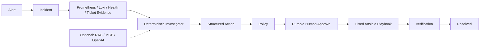
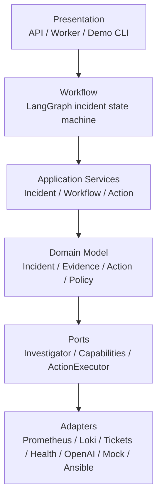
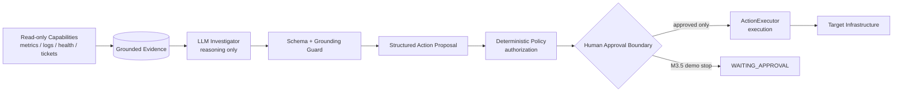

# Architecture

## Local demo architecture snapshot

The canonical `demo-minimal` profile exercises the implemented safety path without optional or paid
dependencies:



`demo-full` adds local Qdrant historical context and the MCP capability plane. Neither changes
Policy, approval, executor, or verification authority.

## M8 governed execution plane

After deterministic Policy and durable approval, operator-owned routing selects an allowlisted
Mock, Ansible, or Harness profile. An atomic execution plus transactional outbox separates
authorization from dispatch. Indeterminate external side effects are reconciled, never blindly
retried, before independent incident verification. See
[the design](design/governed-execution-plane.md).

## M7 MCP capability plane

The MCP `2026-07-28` adapter sits outside Domain, Policy, Executor, and Workflow packages. Its fixed
broker exposes existing observe and memory ports plus a governed remediation proposal. Streamable
HTTP is stateless and scoped; stdio is local-only. LangGraph, deterministic Policy, durable HITL,
and executor mappings remain orchestration and authorization authorities.

## M5 live validation topology

The disposable Incident Lab connects the existing adapters to Prometheus, Loki, PostgreSQL and
small observable services. Fault injection is a typed Lab CLI, not a workflow capability. The
only remediation route remains Policy → durable approval → ActionService → fixed Ansible
playbook → verification. See [design/incident-lab.md](design/incident-lab.md).

## M6 historical memory boundary

M6 adds `KnowledgeRetriever` and `DenseEmbeddingProvider` ports. The Qdrant adapter is
infrastructure-only; workflow and domain code never accept raw vectors, filters, collection names,
or backend URLs. The graph sequence is `collect_context → retrieve_knowledge → investigate`, and
checkpoint state stores knowledge IDs only. Historical Knowledge is not Incident Evidence; Policy,
durable approval, ActionService, and the fixed executor mapping remain unchanged.

## Layer architecture



Dependencies point inward through typed ports: adapters provide infrastructure behavior, while
the domain remains independent of HTTP, databases, model providers, and execution transports.

## Reasoning, authorization, and execution



The LLM cannot authorize or execute. Capabilities are read-only evidence sources. Policy owns
authorization, and the executor receives only structured actions that have crossed policy and
approval boundaries. The M3.5 demo intentionally takes the `WAITING_APPROVAL` branch.

## Operating model

OpsPilot separates three lifecycles with different authority and failure semantics.

M1C adds the durable incident path around those execution lifecycles:

```text
Alert / User
     |
     v
  Incident -> Evidence -> Hypothesis -> Diagnosis -> Action Proposal
                                                   |
                                                   v
                 Knowledge Projection <- Resolve <- Verification
                                                   ^
                                                   |
                            Policy -> Approval -> Execution
```

Incident, Evidence, Hypothesis, Diagnosis, append-only AuditEvent, timeline, optimistic locking,
and the resolved-incident knowledge projection are implemented in M1C. M2 adds LangGraph
orchestration over those application capabilities. M3B adds evidence-grounded structured LLM
reasoning behind an injected provider port. Runtime retrieval/RAG and
multi-agent behavior remain planned.

```text
Observe                         Remediate                         Change
   |                                |                                |
   v                                v                                v
Read-only capabilities       Structured Action              Governed Workflow
metrics / logs / ticket      -> deterministic Policy        -> Harness / GitOps
status / health              -> human approval              (planned)
                              -> Ansible
                              -> verification
```

Observation is automatic and read-only. Metrics, logs, tickets, status, and health return
evidence without mutation authority.

Remediation is bounded recovery such as restart or reload. The API constructs a strict
`ActionRequest`; `ActionPolicyEngine` authorizes it, HITL approves state changes, `ActionService`
orchestrates preview/execute/verify, and an injected Mock or Ansible adapter runs only an
application-owned mapping.

Change includes deploy, rollback, configuration, and IaC. These require rollout, promotion, and
rollback lifecycles, so they remain outside remediation. A future governed backend may integrate
Harness and GitOps; neither is implemented in M1B.

## Portable boundary

- `app/domain` has no transport or infrastructure credential concepts.
- `app/application` depends only on the `ActionExecutor` port.
- API clients cannot select executor, inventory, playbook, process, shell, or argument vector.
- Logical Targets contain identity, environment, description, enabled state, labels, and service
  deployments. Connection data belongs to operator-owned Ansible inventory.
- Playbook mapping is application code; dependency injection selects Mock or Ansible.
- Worker bootstrap is the composition root: each polling iteration derives the enabled Target
  allowlist, constructs one operator-selected Mock or Ansible `ActionService`, and shares it
  between `WorkflowService` and `WorkerService`.
- Workflow runtime never imports or implicitly selects an executor implementation. A workflow
  that reaches policy or execution without an injected `ActionService` fails closed as an
  infrastructure configuration failure.

Ansible may internally use SSH according to operator-owned inventory. That is an implementation
detail, not part of the OpsPilot application, Agent, API, or ActionRequest contract.

## Explicit state, not hidden reasoning

The M2 workflow stores identifiers, status, decision summaries, proposed action types, and risk
results. It does not put ORM objects, sessions, executors, raw logs, or hidden chain-of-thought in
checkpoint state. Nodes call application capabilities and return minimal serializable updates.

Incident status is stable business state, not a future LangGraph node name. Every state change
passes through the explicit lifecycle table and a version compare-and-set. Its AuditEvent is
inserted in the same transaction. Incident/action association lives in the application layer, so
the reusable Action domain contains no Incident ORM or foreign key.

The Incident database is the domain source of truth. LangGraph checkpoints only record execution
position and workflow-local references. `WorkflowRun` is durable OpsPilot metadata and uses a
stable graph thread identifier equal to its workflow ID. M2's in-memory checkpointer is limited to
development and tests. `WorkflowService` accepts LangGraph's existing `BaseCheckpointSaver`
directly instead of wrapping it in a second application-specific checkpoint port. Durable
Postgres checkpoint and approval resume remain deferred to M4.

## Read-only investigation capabilities

M3A adds a dependency-injected `IncidentCapabilities` registry between workflow runtime and typed
Metrics, Logs, Tickets, and Health ports. Prometheus and Loki adapters translate domain queries
into application-owned PromQL and LogQL templates. Base URLs, bearer credentials, and Loki tenant
headers are operator configuration and never appear in API schemas, graph state, or evidence.

`collect_context` requests a bounded time window, isolates timeout/unavailable/malformed failures,
persists successful observations as deduplicated Incident Evidence, and returns only evidence IDs
to LangGraph. Metrics, logs, tickets, and health remain parallel read-only evidence sources;
`ActionService` remains the policy-controlled remediation boundary. The Health port may reuse a
read-only Action request internally, but workflow nodes see only `get_service_health`.
# M4 durable approval boundary

LangGraph continuation state now uses a PostgreSQL checkpointer in durable deployments. It remains
separate from Incident business facts and `WorkflowRun` metadata. Mutating remediation pauses with
an interrupt after policy assessment, creates an auditable `ApprovalRequest`, and resumes the same
workflow thread after an authenticated decision. The resumed action still enters `ActionService`
and deterministic policy before the executor.
