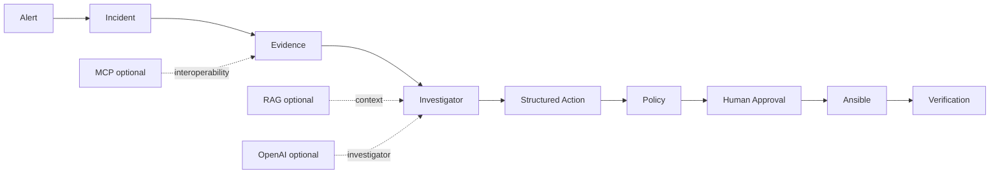

# OpsPilot 10-Minute Demo

## 1. What problem it solves

OpsPilot turns an operational signal into a bounded, auditable response. The investigator proposes;
current evidence, deterministic policy, a human approval, a fixed executor, and verification decide
what can happen.

## 2. Architecture in 30 seconds



Keywords: **evidence before action**, **assistance is not authority**, **verification is separate
from execution success**.

## 3. Start the demo

```bash
make demo-doctor
make demo-local
```

The command starts a disposable synthetic environment, waits for readiness, resets state, and runs
the entire scenario. It needs Docker and Compose, but no API key or external SaaS.

## 4–6. Incident, evidence, diagnosis

Point out the deterministic `service-down` fault, the Prometheus/Loki/Health/Mock Ticket evidence,
and the diagnosis. Historical cases are deliberately not required by the minimal profile.

Talk track: “The diagnosis is grounded in observations from this incident. Logs are untrusted data,
not instructions.”

## 7. Approval boundary

Pause at `Approval required`. The demo identity explicitly approves through the real
`ApprovalService`; the workflow cannot continue from `WAITING_APPROVAL` without it.

Talk track: “MEDIUM risk does not become safe because an investigator proposed it.”

## 8–9. Remediation and verification

Show the fixed `restart_service.yml` mapping and then the independent health verification.

Talk track: “Ansible success is not enough. The Incident resolves only after current health verifies
recovery.”

## 10. Safety close

The model cannot select a shell command, playbook, inventory, target, policy decision, or approval.
For optional historical-memory and MCP interoperability demonstrations, use `make demo-full` after
the core story.

Cleanup:

```bash
make demo-down
```
