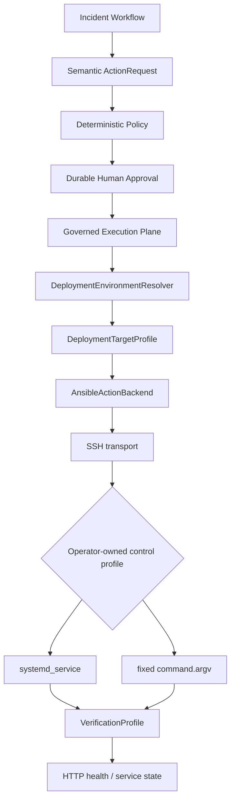

# Deployment Compatibility and Legacy Migration Bridge

M8.5 demonstrates how OpsPilot can integrate with traditional SSH-managed test environments. The
checked-in environment is a **synthetic local lab**, not an enterprise deployment and not evidence
that OpsPilot has been deployed to any company server.

## Compatibility architecture



SSH is allowed as an infrastructure transport detail. Domain, Application, Workflow, LLM, MCP and
the compatibility HTTP request never receive a hostname, SSH username, private key, inventory path,
script path, argv or shell syntax. The removed `ServiceSSH`, `SSHExecutor`, `RemoteCommand`,
`CommandBuilder` and `SSHConfig` abstractions remain absent.

## Configuration contracts

All deployment knowledge is operator-owned, versioned YAML validated by a Pydantic schema with
unknown fields forbidden. The public examples use only `demo-api`, `demo-worker`, synthetic users,
and synthetic endpoints.

- `DeploymentTargetProfile` maps service, environment and semantic target identity to profile refs.
- `AnsibleConnectionProfile` maps an inventory ref, host alias, user ref, privilege requirement and
  timeout. It contains no credential value.
- `ServiceControlProfile` maps semantic services to fixed systemd units or fixed script identifiers.
- `VerificationProfile` owns success criteria, retries, timeout and required checks.
- `LegacyTicketProfile` maps the existing ticket capability to a bounded HTTP fixture contract.

Credentials are resolved from environment-named secret-file references. Missing credentials fail
closed. The repository, preview, API, audit and telemetry paths never include secret contents.

## Two service-control modes

The same `ActionRequest(RESTART_SERVICE, service=demo-api)` can resolve to either mode:

| Mode | Operator mapping | Ansible implementation |
| --- | --- | --- |
| SYSTEMD | `demo-api` → `opspilot-demo-api.service` | `ansible.builtin.systemd_service` |
| FIXED_SCRIPT | `demo-api` → `demo-api`, fixed script path | `ansible.builtin.command` with `argv` |

The fixed-script playbook receives only a mapped script path, enum-derived operation and mapped
service ID. There is no `shell`, `extra_args`, pipe, redirection, flags API or caller-supplied full
command. Values such as `; rm -rf`, `$(...)`, `| bash` and `--exec` fail schema validation.

## Execution and verification

Backend success is not service health. A mutating workflow is resolved only after:

```text
Ansible submitted successfully
→ required HTTP/service/process checks
→ Verification PASSED
→ Incident RESOLVED
```

HTTP endpoints and expected states are selected by the operator profile. An LLM cannot choose an
endpoint or weaken success criteria.

## Read-only tooling

- `make deployment-preview PROFILE=example-legacy-test` prints semantic routing without commands,
  hosts, users or credentials.
- `make deployment-doctor PROFILE=example-legacy-test` checks schema, inventory, secret reference,
  SSH/Ansible connectivity, privilege context, mapping, health, database and ports. It uses only
  fixed read-only playbooks.
- `make migration-assess PROFILE=example-legacy-test` produces readiness levels without mutation.

The doctor never restarts services, installs packages or changes remote configuration.

## Readiness and observability fallback

- `OBSERVE_READY`: health or metrics can provide current evidence.
- `REMEDIATION_READY`: observation, governed execution and verification are available.
- `FULL_INCIDENT_READY`: metrics, logs, health, tickets and execution are all integrated.

Legacy environments can start at health-only, add an existing monitoring adapter, and later add
Prometheus/Loki. M8.5 never installs agents or modifies a target to manufacture observability.
