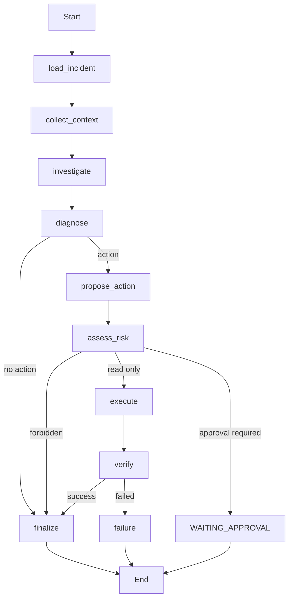

# LangGraph Incident Workflow

M2 composes the existing Incident and Action application boundaries with a deterministic
LangGraph `StateGraph`:

## State and capabilities

`IncidentWorkflowState` is JSON-serializable and carries IDs, status, structured investigation
fields, action type, risk, verification status, and safe errors. Durable Incident data remains in
SQL tables. Each node receives application capabilities through LangGraph runtime context and
returns a minimal state update; nodes do not query SQLAlchemy or invoke subprocesses directly.
The runtime receives an operator-configured `ActionService` from worker bootstrap. The selected
Mock or Ansible executor and enabled Target allowlist are therefore identical for workflow and
ordinary Operation execution. Missing execution capability is a configuration failure; there is
no production Mock fallback.

The investigator is deterministic in M2. Service-status evidence containing `unavailable`
proposes a restart, `read-only-check` proposes a status action, and other evidence produces no
action. These rules make routing reproducible without an LLM or hidden reasoning.

## Persistence, replay, and trace

`workflow_runs` records business metadata independently from checkpoints. `WorkflowService`
depends directly on LangGraph's `BaseCheckpointSaver`; M2 development and tests inject
`InMemorySaver`, while a durable Postgres saver remains M4 scope. Idempotency is scoped
by Incident, actor, and client key. Stable graph configuration uses the WorkflowRun ID as
`thread_id`. Hypothesis, diagnosis, proposal, execution reference, finalization, and workflow
audit emission guard against terminal or duplicate replay.

Before adapter dispatch, the execute capability durably records `workflow_id`, the stable
`action_fingerprint`, and `execution_task_id`. A retry can reuse a terminal result, but an
in-progress/indeterminate reference fails closed for manual reconciliation instead of dispatching
the same action again. This provides at-most-once dispatch in M2; end-to-end durable executor
receipts and automated reconciliation remain future work.

Node start/completion and workflow start/pause/failure/completion events are appended to the
Incident audit timeline with only node, duration, workflow ID, correlation ID, and safe status.
Graph state is never dumped into audit.

M2 retries only `WorkflowInfrastructureFailure` at the execution node. Domain errors, forbidden
policy, approval boundaries, and verification failure are not retried. Medium-risk mutation stops
in `WAITING_APPROVAL`; M4 will add identity-bound durable interrupt/resume.

The boundaries remain distinct: the Incident database is durable business truth, the LangGraph
checkpoint stores workflow execution/recovery position, and `WorkflowRun` provides queryable
workflow metadata. None substitutes for another.
