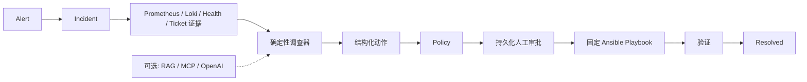

# 架构（Architecture）

[English](../architecture.md) | [简体中文](architecture.md)

## 本地演示架构快照

默认 `demo-minimal` profile 在不依赖可选或付费服务的情况下验证已实现的安全链：



`demo-full` 增加本地 Qdrant 历史上下文和 MCP capability plane，但不改变 Policy、
审批、执行器或验证的权威边界。Harness 与 GitOps 仍是未来 M8/M9 工作。

## 运行模型

OpsPilot 将三个生命周期（lifecycle）彼此分离，它们各自拥有不同的权威（authority）与失败语义（failure semantics）。

M1C 在这些执行生命周期之上增加了持久的 Incident（事故/事件实例）路径：

```text
Alert / User
     |
     v
  Incident -> Evidence -> Hypothesis -> Diagnosis -> Action Proposal
                                                   |
                                                   v
                 Knowledge Projection <- Resolve <- Verification
                                                   ^
                                                   |
                            Policy -> Approval -> Execution
```

Incident、Evidence、Hypothesis、Diagnosis、只追加（append-only）的 AuditEvent、时间线、乐观锁（optimistic locking），以及已解决事故的知识投影（knowledge projection）均在 M1C 中实现。M2 在这些应用能力之上增加了 LangGraph 编排。M3B 在注入的 Provider 端口（Port）之后增加了基于证据的结构化 LLM 推理（evidence-grounded structured LLM reasoning）。运行时检索/RAG 与多智能体（multi-agent）行为仍处于计划阶段。

```text
Observe                         Remediate                         Change
   |                                |                                |
   v                                v                                v
Read-only capabilities       Structured Action              Governed Workflow
metrics / logs / ticket      -> deterministic Policy        -> Harness / GitOps
status / health              -> human approval              (planned)
                              -> Ansible
                              -> verification
```

观察（Observation）是自动且只读的。指标（metrics）、日志（logs）、工单（tickets）、状态（status）与健康（health）返回证据（Evidence），但不具备变更权威（mutation authority）。

修复（Remediation）是有边界的恢复操作，例如重启或重载。API 构造严格的 `ActionRequest`；`ActionPolicyEngine` 对其授权，HITL（Human-in-the-loop，人在回路）审批状态变更，`ActionService` 编排预览/执行/验证（preview/execute/verify），注入的 Mock 或 Ansible 适配器（Adapter）只运行应用自有的映射。

变更（Change）包括部署、回滚、配置与 IaC。它们需要发布（rollout）、提升（promotion）与回滚生命周期，因此仍处于修复范畴之外。未来的受管控后端（governed backend）可能集成 Harness 与 GitOps；二者在 M1B 中均未实现。

## 可移植边界

- `app/domain` 不含任何传输或基础设施凭据概念。
- `app/application` 只依赖 `ActionExecutor` 端口（Port）。
- API 客户端无法选择 executor、inventory、playbook、process、shell 或参数向量（argument vector）。
- 逻辑 Target（Logical Target）包含身份、环境、描述、启用状态、标签与服务部署信息。连接数据属于运维人员所有的 Ansible inventory。
- Playbook 映射是应用代码；依赖注入选择 Mock 或 Ansible。
- Worker 引导（bootstrap）是组合根（composition root）：每次轮询迭代都会派生启用的 Target 白名单，构造一个由运维人员选择的 Mock 或 Ansible `ActionService`，并在 `WorkflowService` 与 `WorkerService` 之间共享它。
- 工作流运行时从不导入或隐式选择 executor 实现。若工作流在未注入 `ActionService` 的情况下到达策略（Policy）或执行（Execution）阶段，将按基础设施配置失败（infrastructure configuration failure）默认关闭（fail closed）。

Ansible 可根据运维人员所有的 inventory 在内部使用 SSH。这是实现细节，不属于 OpsPilot 应用、Agent、API 或 ActionRequest 契约的一部分。

## 显式状态，而非隐藏推理

M2 工作流在检查点状态中存储标识符、状态、决策摘要、提议的动作类型与风险结果。它不会把 ORM 对象、会话、executor、原始日志或隐藏的思维链（chain-of-thought）放入检查点状态。节点调用应用能力并返回最小的可序列化更新。

事故（Incident）状态是稳定的业务状态，而不是未来的 LangGraph 节点名称。每一次状态变更都经过显式的生命周期表和版本 compare-and-set（比较并设置）。其 AuditEvent 在同一事务中插入。事故/动作关联位于应用层，因此可复用的 Action 域不包含事故 ORM 或外键。

事故数据库是领域的事实来源（source of truth）。LangGraph 检查点只记录执行位置与工作流本地引用。`WorkflowRun` 是持久的 OpsPilot 元数据，并使用一个与其工作流 ID 相等的稳定图线程标识符。M2 的内存检查点器（in-memory checkpointer）仅限于开发与测试。`WorkflowService` 直接接受 LangGraph 现有的 `BaseCheckpointSaver`，而不是将它包装在第二个应用专用的检查点端口中。持久化 Postgres 检查点与审批恢复仍推迟到 M4。

## 只读调查能力

M3A 在工作流运行时与类型化的 Metrics、Logs、Tickets 和 Health 端口之间增加了依赖注入的 `IncidentCapabilities` 注册表。Prometheus 与 Loki 适配器把领域查询转换为应用自有的 PromQL 与 LogQL 模板。Base URL、bearer 凭据与 Loki tenant 头都属于运维人员配置，绝不会出现在 API 模式、图状态或证据中。

`collect_context` 请求有界的时间窗口，隔离超时/不可用/格式错误等失败，把成功的观测持久化为去重后的事故证据（Incident Evidence），并且只向 LangGraph 返回证据 ID。指标、日志、工单与健康仍然是并行的只读证据来源；`ActionService` 仍然是受策略控制的修复边界。Health 端口可以在内部复用只读的 Action 请求，但工作流节点只看到 `get_service_health`。
