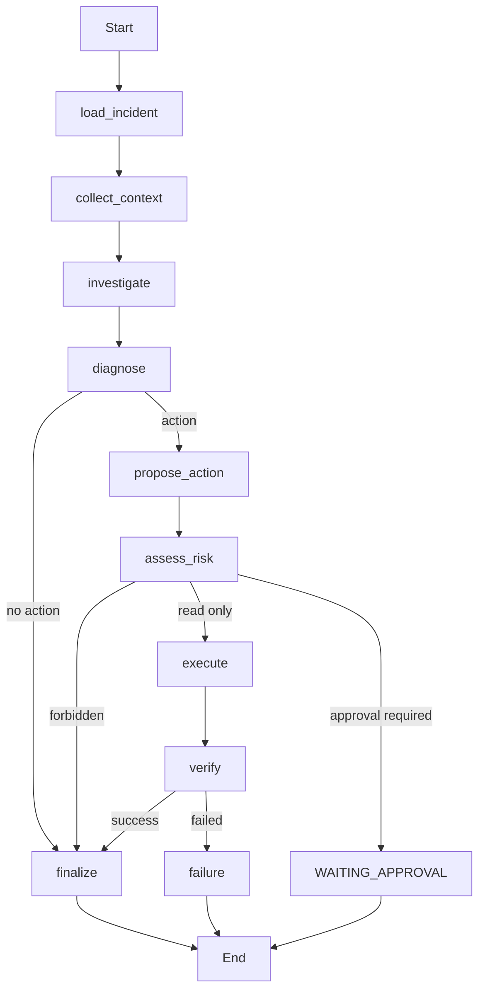

# LangGraph 事故工作流（LangGraph Incident Workflow）

[English](../../design/langgraph-incident-workflow.md) | [简体中文](langgraph-incident-workflow.md)

M2 用确定性的 LangGraph `StateGraph` 组合既有的 Incident 与 Action 应用边界：

## 状态与能力（State and capabilities）

`IncidentWorkflowState` 可 JSON 序列化，携带 ID、状态、结构化调查字段、动作类型、风险、验证状态与安全错误。持久化的 Incident 数据仍存放在 SQL 表中。每个节点通过 LangGraph 运行时上下文获得应用能力，并返回最小化的状态更新；节点不直接查询 SQLAlchemy，也不直接调用子进程。运行时从 worker 启动处获得运维配置的 `ActionService`。因此，所选的 Mock 或 Ansible 执行器与启用的 Target 白名单，对工作流与普通 Operation 执行是完全一致的。缺少执行能力属于配置错误，不存在生产环境下的 Mock 兜底。

M2 中的调查器是确定性的：包含 `unavailable` 的服务状态证据提议重启，`read-only-check` 提议状态类动作，其他证据不产生动作。这些规则让路由可以在没有 LLM 或隐藏推理的情况下复现。

## 持久化、重放与追踪（Persistence, replay, and trace）

`workflow_runs` 独立于检查点（checkpoint）记录业务元数据。`WorkflowService` 直接依赖 LangGraph 的 `BaseCheckpointSaver`；M2 的开发与测试注入 `InMemorySaver`，而持久的 Postgres saver 仍属于 M4 的范围（计划中，尚未实现）。幂等性按 Incident、执行者与客户端键划定范围。稳定的图配置使用 WorkflowRun ID 作为 `thread_id`。假设、诊断、提议、执行引用、终结以及工作流审计的发出均有防护，避免进入终态或发生重复重放。

在适配器分发之前，执行能力会持久记录 `workflow_id`、稳定的 `action_fingerprint` 与 `execution_task_id`。重试可以复用终态结果，但进行中/状态不确定的引用会为人工对账而安全失败（fail closed），而不是再次分发同一动作。这为 M2 提供至多一次（at-most-once）分发；端到端的持久执行回执与自动对账仍是未来工作。

节点开始/完成以及工作流开始/暂停/失败/完成事件，会以仅包含节点、耗时、工作流 ID、关联 ID 与安全状态的形式追加到 Incident 审计时间线。图状态永远不会被转储进审计。

M2 只在执行节点重试 `WorkflowInfrastructureFailure`。领域错误、被策略禁止（forbidden policy）、审批边界与验证失败都不会重试。中风险变更会停在 `WAITING_APPROVAL`；绑定身份的持久化中断/恢复（durable interrupt/resume）将在 M4 中实现（计划中，尚未完成）。

这些边界依然彼此分明：Incident 数据库是持久的业务事实来源，LangGraph 检查点保存工作流执行/恢复位置，`WorkflowRun` 提供可查询的工作流元数据。三者互不替代。
